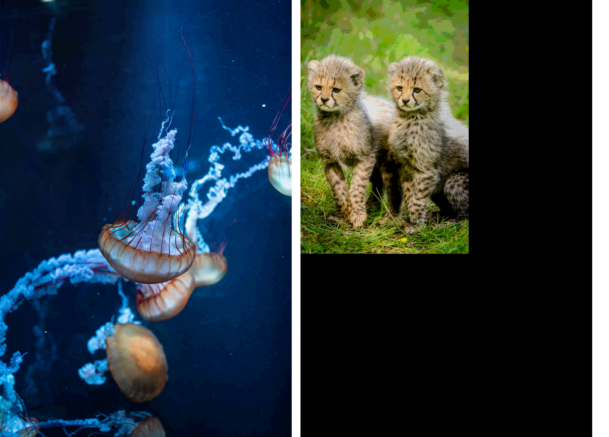

## Steganographer

A command line tool that lets you hide one file into another

#### Introduction 

_Steganography_ is the practice of concealing messages and information within
other non-secret text or data.  The necessity to conceal information can be
traced back millenia, and has played an important role throughout history,
moreso in times where keeping something from prying eyes is much harder.  One
way to hide a message is to use some method of encryption, effectively rendering
the information useless to a person who wouldn't know how to reverse the
process. This method (called cryptography), however, usually results in
unintelligible information which makes it obvious that a secret is hidden within
the sequence present. 

The problem can be avoided by using another way to hide information: hiding it
in plain sight.  This approach is greatly facilitated by the usage of computers.
As all information consists of streams of bytes, it is possible to alter the
least significant bit of each one in a way that they store a hidden message.
For example, altering the least significant bit in a pixel of an image file
wouldn't not lead to difference noticeable to the human eye, but would allow to
store one binary bit of hidden information.

#### What it does

 
|  |
|:--:|
| image with hidden message (left) and the message recovered (right) |

In order to hide information this program replaces a set amount of least
significant bits (LSBs) of a cover image with an equal number of most
significant bits (MSBs) of a secret image. Unavoidably, information related to
the images is lost during the process. To increase the quality of the hidden
image we need to replace a higher number of LSBs in the cover, but the more bits
we replace the more visible the contrast between the cover and the secret
becomes. A balance must be struck in order to hide the secret effectively and
not render the hiding process pointless. 

#### Dependencies

Functionality has only been verified on a Linux system (Ubuntu 18.04)
The program uses [libpng](http://www.libpng.org/pub/png/libpng.html) for the PNG
images' I/O operations.
As far as I can tell, there shouldn't be any other requirement to compile and
run.

#### Installation

First you must obtain the source code and navigate to the directory. You can
quickly do this by cloning this repository using its url using the following
command: 
``` 
git clone https://github.com/BAlexandros/Steganographer && cd Steganographer
```
Now you must compile the source code. This can be done using the supplied
Makefile, or manually if you wish. 
If you want to use the Makefile, you have to be in the parent directory of the
project and run one of the following commands:

- `make` will simply create a `steganize` executable in the current directory

- `make install` will create a `steganize` executable in the /bin directory, so it
may require root permissions

#### Usage

The program can be run with the `./steganize` command from the local directory,
or just `steganize` if you used `make install`.

I've tried my best to give a descriptive help message to the tool, which can be
viewed if you run the program without any arguments, or with the help flag (`-h`
or `--help`)

The main usage of the tool is as follows:
```
steganize -e /path/to/cover/file.png /path/to/secret/file.png
```
This will hide the secret file (*/path/to/secret/file.png*) into the cover file
(*/path/to/cover/file.png*) and write the result to a file named *out.png*.

To recover a hidden image from another image, use the `-d` flag:
```
steganize -d /path/to/combined/file.png
```
This will create a file named `out.png` which contains the hidden image.

The `-o` flag can be used in either case to change the output file name. For
example:
```
steganize -d /path/to/combined/file.png -o /path/to/output/file.png
```

An important flag is the significant bits flag `-s`. The number following this
flag determines the number of LSBs that will be replaced in the cover image and
MSBs that will be kept from the secret.
For example:
```
steganize -e file1.png file2.png -s 2
```
The above command would replace the 2 LSBs from *file1.png* with the 2 MSBs from
*file2.png*
The default number of significant bits is 4.

*Note:* If you use the `-s` flag when combining two files, you will have to use
it again (and supply it with the same argument) in order to properly recover the
image with the `-b` flag.


#### Uninstall 

To either remove part of, or the entire program, you have the following options:

- `make clean` will remove the executable from the current directory

- `make uninstall` will remove the executable from the /bin directory (might
  require root permissions)

- `make allclean` will remove all the source files and executables related to the
program (may need root permissions if `make install` was used). Using this
command means that you would have to repeat the installation to use the tool
again.

_The images used were taken from https://www.pexels.com_
